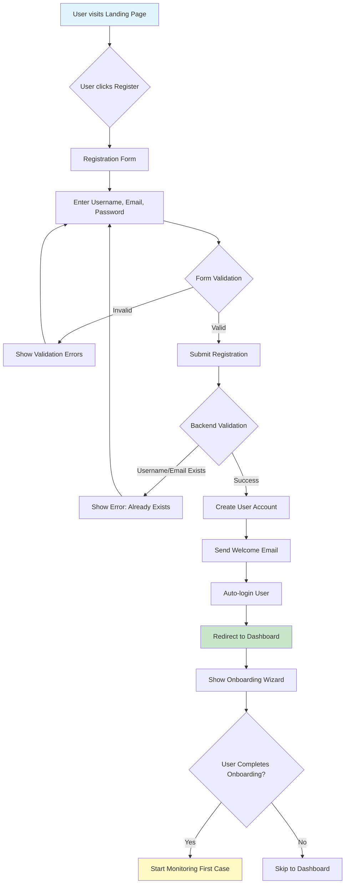
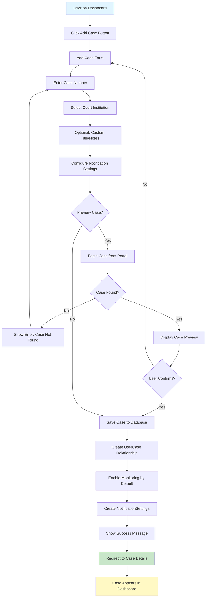
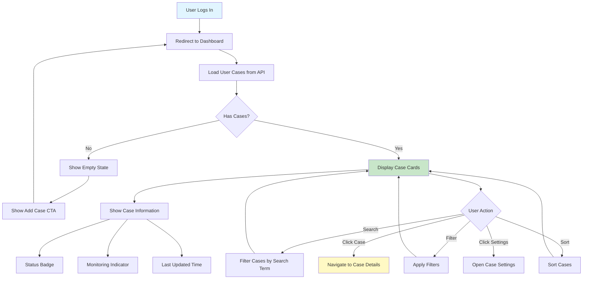
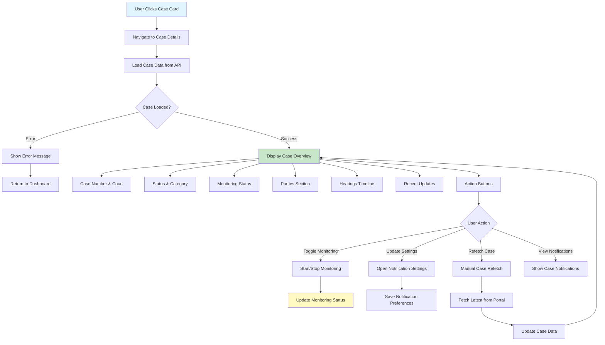
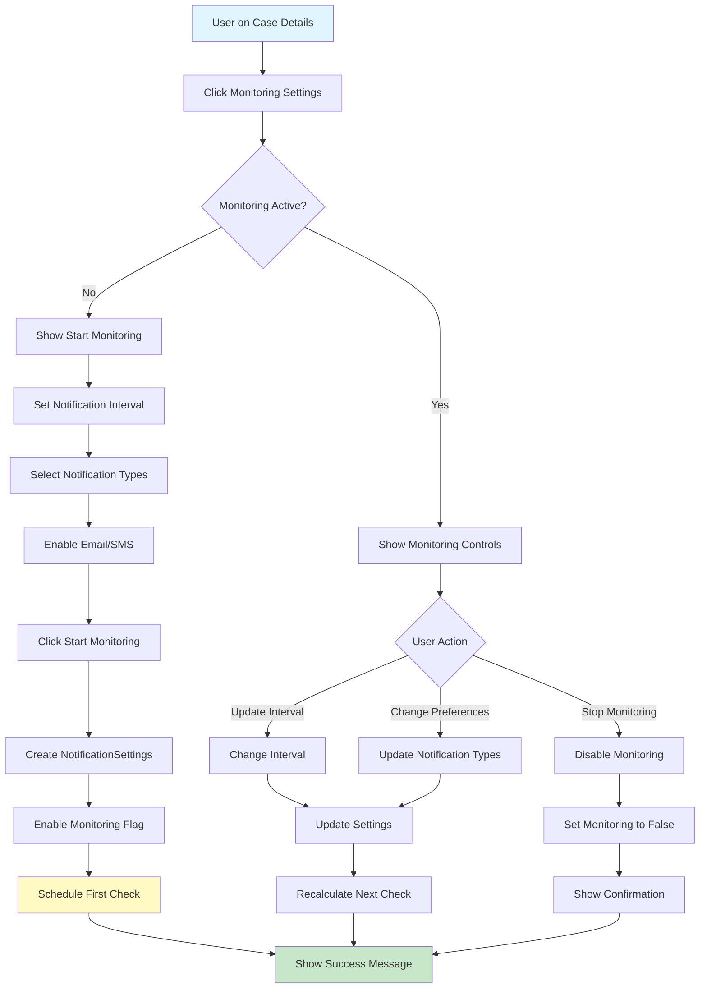
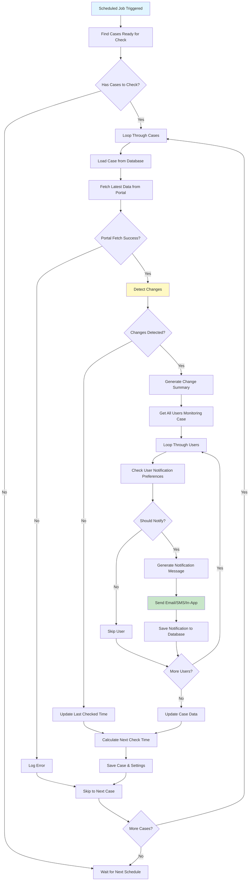
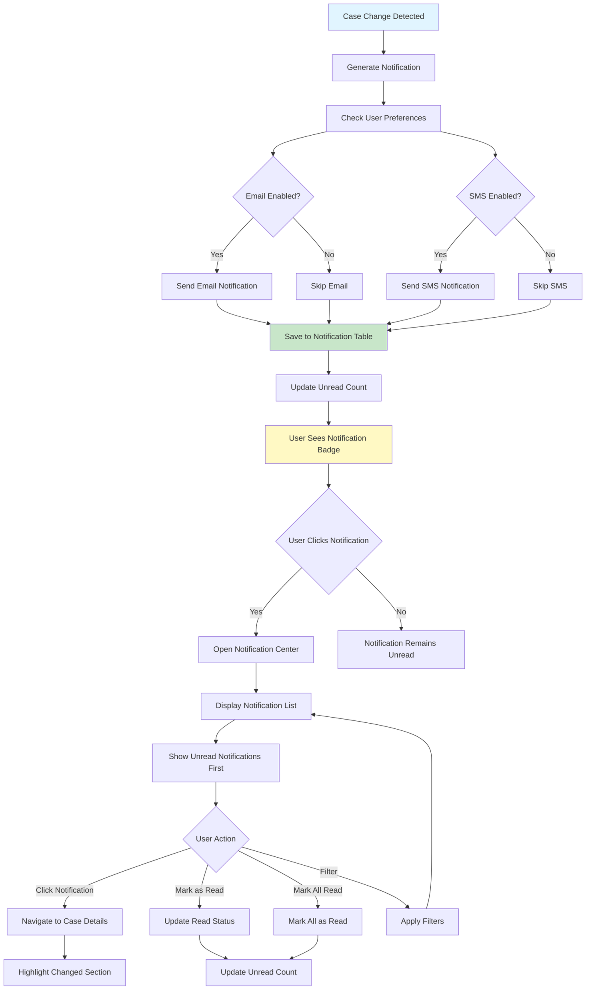
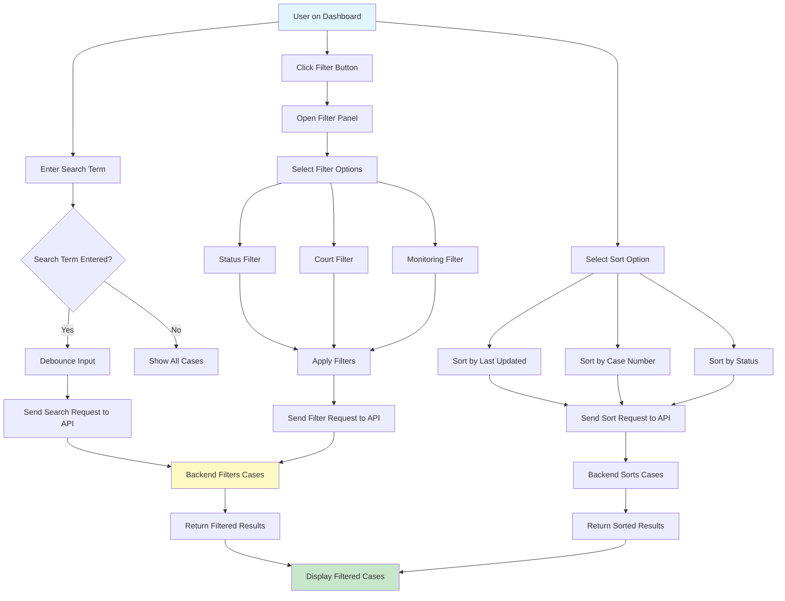
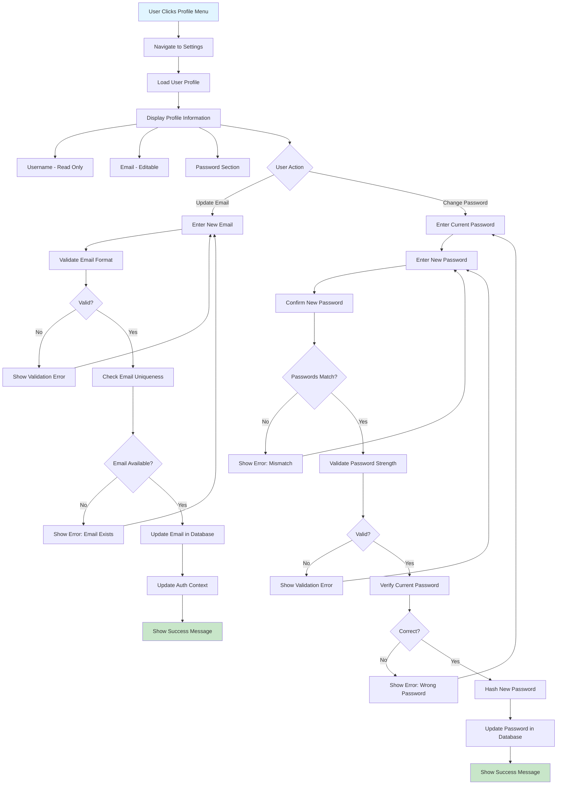
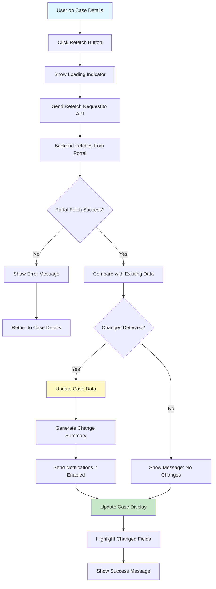

# Case Observer - Business Use Cases & Customer Motivations

This document defines all business use cases with Mermaid flow diagrams, customer motivation points, and potential features to attract customers.

---

## Use Case 1: User Registration & Onboarding

### Customer Motivation Points
- **Time Savings**: Quick registration process (under 2 minutes)
- **Security**: Secure account with password protection
- **Free Trial**: Start monitoring cases immediately after registration
- **Professional Credibility**: Platform designed for legal professionals

### Potential Attractive Features
- ✅ Email verification (builds trust)
- ✅ Welcome email with getting started guide
- ✅ Pre-filled court institution list (saves time)
- ✅ Onboarding wizard (first case setup)
- ⭐ **Premium Feature**: Skip email verification for verified legal professionals

### Mermaid Flow Diagram

---

## Use Case 2: Add Case to Monitor

### Customer Motivation Points
- **Automation**: No need to manually check court portals daily
- **Time Efficiency**: Add case in seconds vs. minutes of manual checking
- **Accuracy**: Automated data fetching reduces human error
- **Multi-case Management**: Monitor unlimited cases from one dashboard

### Potential Attractive Features
- ✅ Case number validation (prevents errors)
- ✅ Real-time case preview before adding
- ✅ Suggested court institutions (autocomplete)
- ✅ Custom case titles/notes (organization)
- ✅ Bulk import (CSV/Excel) for law firms
- ⭐ **Premium Feature**: Priority case fetching (faster updates)
- ⭐ **Premium Feature**: Case templates for common case types

### Mermaid Flow Diagram

---

## Use Case 3: View Case Dashboard & List

### Customer Motivation Points
- **Overview**: See all monitored cases at a glance
- **Status Awareness**: Quick view of case statuses and updates
- **Organization**: Filter and sort cases for easy management
- **Efficiency**: No need to visit multiple court portals

### Potential Attractive Features
- ✅ Real-time status badges (ON/OFF monitoring)
- ✅ Last update timestamps
- ✅ Quick actions (view, settings, stop monitoring)
- ✅ Search across all case fields
- ✅ Advanced filters (court, status, date range)
- ✅ Sort by multiple criteria
- ✅ Grid/List view toggle
- ⭐ **Premium Feature**: Custom dashboard widgets
- ⭐ **Premium Feature**: Case grouping/tags
- ⭐ **Premium Feature**: Saved filter presets

### Mermaid Flow Diagram

---

## Use Case 4: View Case Details

### Customer Motivation Points
- **Complete Information**: All case data in one place
- **History Tracking**: See all hearings and parties
- **Change Visibility**: View what changed and when
- **Control**: Manage monitoring settings from one page

### Potential Attractive Features
- ✅ Complete case information display
- ✅ Hearings timeline with dates
- ✅ Parties list with roles
- ✅ Change history/updates log
- ✅ Monitoring status and controls
- ✅ Notification settings per case
- ✅ Manual refetch button
- ⭐ **Premium Feature**: Case timeline visualization
- ⭐ **Premium Feature**: Document attachments
- ⭐ **Premium Feature**: Case notes/comments
- ⭐ **Premium Feature**: Export case to PDF

### Mermaid Flow Diagram

---

## Use Case 5: Configure Case Monitoring

### Customer Motivation Points
- **Customization**: Set monitoring intervals per case
- **Control**: Choose what changes to be notified about
- **Flexibility**: Enable/disable monitoring anytime
- **Efficiency**: Optimize notification frequency

### Potential Attractive Features
- ✅ Custom monitoring intervals (30min to 24h)
- ✅ Selective notification types (status, hearings, parties)
- ✅ Email/SMS toggle
- ✅ Quick start/stop monitoring
- ✅ Monitoring schedule preview
- ⭐ **Premium Feature**: Smart intervals (AI-suggested based on case activity)
- ⭐ **Premium Feature**: Monitoring templates
- ⭐ **Premium Feature**: Bulk monitoring configuration

### Mermaid Flow Diagram

---

## Use Case 6: Automatic Case Monitoring (Background Process)

### Customer Motivation Points
- **Automation**: No manual work required
- **Reliability**: Consistent checking even when user is away
- **Timeliness**: Get notified as soon as changes occur
- **Peace of Mind**: Never miss important case updates

### Potential Attractive Features
- ✅ Scheduled automatic checks
- ✅ Configurable check intervals
- ✅ Change detection algorithm
- ✅ Automatic notification delivery
- ✅ Case data synchronization
- ⭐ **Premium Feature**: Priority monitoring (faster checks)
- ⭐ **Premium Feature**: Predictive monitoring (AI-based scheduling)
- ⭐ **Premium Feature**: Monitoring analytics (check frequency, change patterns)

### Mermaid Flow Diagram

---

## Use Case 7: Receive & View Notifications

### Customer Motivation Points
- **Immediate Awareness**: Know about changes instantly
- **Multi-channel**: Email, SMS, and in-app notifications
- **Centralized**: All notifications in one place
- **Actionable**: Quick access to relevant case

### Potential Attractive Features
- ✅ Real-time notification delivery
- ✅ Notification center with history
- ✅ Unread badge counter
- ✅ Mark as read functionality
- ✅ Filter by case/type/date
- ✅ Notification preferences
- ⭐ **Premium Feature**: Push notifications (mobile)
- ⭐ **Premium Feature**: Notification digest (daily/weekly summary)
- ⭐ **Premium Feature**: Custom notification templates

### Mermaid Flow Diagram

---

## Use Case 8: Search & Filter Cases

### Customer Motivation Points
- **Efficiency**: Quickly find specific cases
- **Organization**: Manage large case lists easily
- **Flexibility**: Multiple search and filter options
- **Time Savings**: No scrolling through long lists

### Potential Attractive Features
- ✅ Full-text search (case number, court, subject)
- ✅ Multiple filter options (status, court, monitoring)
- ✅ Sort by various criteria
- ✅ Server-side filtering (fast performance)
- ✅ Search history/suggestions
- ⭐ **Premium Feature**: Advanced search (date ranges, multiple criteria)
- ⭐ **Premium Feature**: Saved searches
- ⭐ **Premium Feature**: Search analytics (most searched terms)

### Mermaid Flow Diagram

---

## Use Case 9: User Profile & Settings Management

### Customer Motivation Points
- **Control**: Manage account information
- **Security**: Change password for account safety
- **Personalization**: Update email preferences
- **Trust**: Professional account management

### Potential Attractive Features
- ✅ Profile information display
- ✅ Email update
- ✅ Password change
- ✅ Account security settings
- ⭐ **Premium Feature**: Two-factor authentication
- ⭐ **Premium Feature**: Account activity log
- ⭐ **Premium Feature**: API key management

### Mermaid Flow Diagram

---

## Use Case 10: Manual Case Refetch

### Customer Motivation Points
- **Control**: Get latest data on demand
- **Urgency**: Check for updates immediately
- **Reliability**: Verify case data is current
- **Flexibility**: Don't wait for scheduled check

### Potential Attractive Features
- ✅ One-click case refresh
- ✅ Loading indicator during fetch
- ✅ Show what changed after refetch
- ✅ Refetch history
- ⭐ **Premium Feature**: Bulk refetch (multiple cases)
- ⭐ **Premium Feature**: Scheduled refetch

### Mermaid Flow Diagram

---

## Summary of Customer Value Propositions

### Core Value Drivers
1. **Time Savings**: Automate manual case checking
2. **Reliability**: Never miss important updates
3. **Efficiency**: Manage multiple cases from one dashboard
4. **Convenience**: Multi-channel notifications
5. **Control**: Customizable monitoring preferences

### Premium Feature Opportunities
- Priority monitoring (faster checks)
- Bulk operations (efficiency for law firms)
- Advanced analytics (case insights)
- API access (integration capabilities)
- White-label options (for law firms)
- Mobile app with push notifications
- Document management
- Team collaboration features

---

**Next Step**: After your confirmation, I will analyze these use cases against the issues in CODE_REVIEW_TASKS.md to identify:
- Which issues impact each use case
- Priority fixes needed for each workflow
- Risk assessment per use case
- Recommendations for improvement

